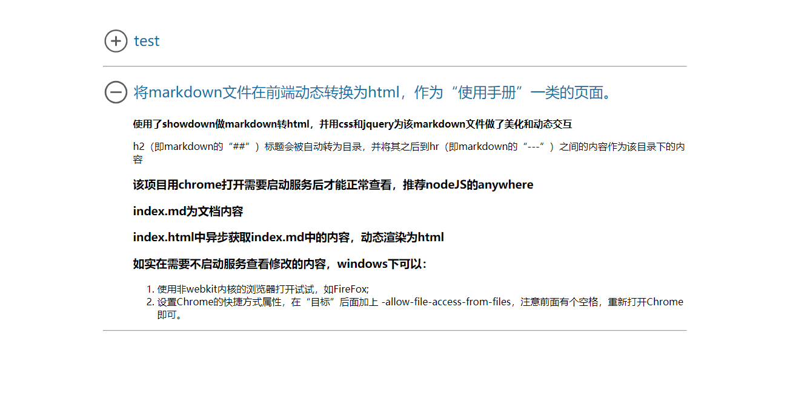

## 将markdown文件在前端动态转换为html，作为“使用手册”一类的页面。
**使用了showdown做markdown转html，并用css和jquery为该markdown文件做了美化和动态交互**

h2（即markdown的“##”）标题会被自动转为目录，并将其之后到hr（即markdown的“---”）之间的内容作为该目录下的内容

### 该项目用chrome打开需要启动服务后才能正常查看，推荐nodeJS的anywhere

### index.md为文档内容

### index.html中异步获取index.md中的内容，动态渲染为html

### 如实在需要不启动服务查看修改的内容，windows下可以：
1. 使用非webkit内核的浏览器打开试试，如FireFox;
2. 设置Chrome的快捷方式属性，在“目标”后面加上 -allow-file-access-from-files，注意前面有个空格，重新打开Chrome即可。

---
